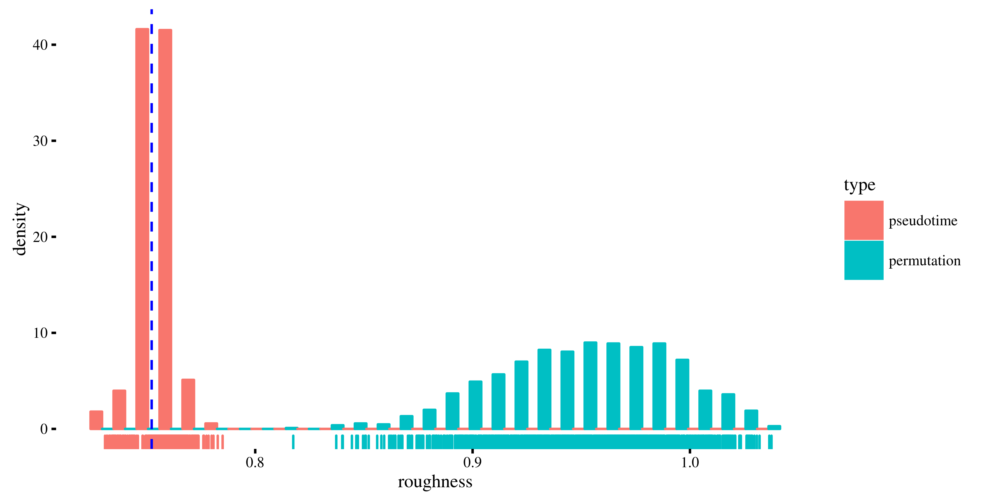
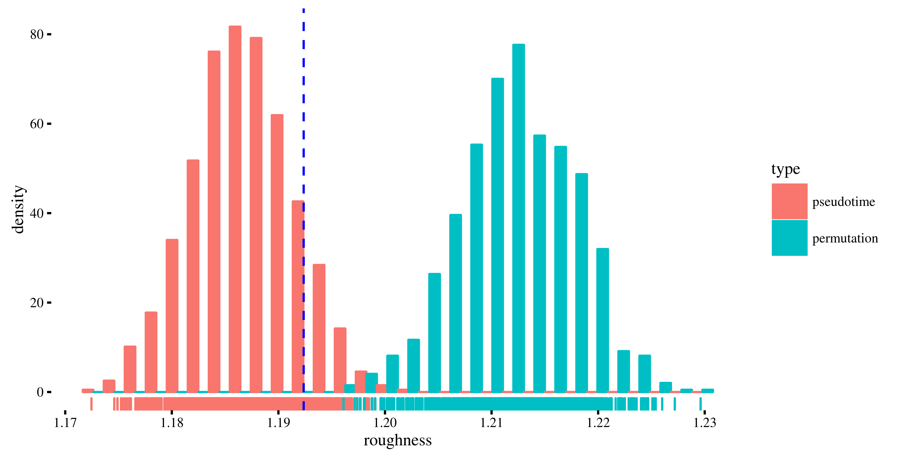

<style>
em {
  font-style: italic
}
</style>

## Overview
- Single cell transcriptomics and pseudotime estimation
- Existing methods
- Gaussian process latent variable model
- Results
  * Arabidoposis response to infection
  * Cell cycle in cancer cells
  * Paracrine signalling in mouse dendritic cells

```{r compile, eval=FALSE, echo=FALSE}
devtools::load_all("/home/john/Dev/DeLorean")
slidify::slidify('index.Rmd')
```

```{r knitConfig, echo=FALSE}
knitr::opts_chunk$set(
    echo = FALSE,
    fig.path = 'figures/slides-',
    # fig.width = 12,
    # fig.height = 8,
    dev = 'svg',
    stop_on_error = TRUE)
```

```{r fig-templates, echo=FALSE}
knitr::opts_template$set(half.slide.fig = list(
    echo=FALSE,
    message=FALSE,
    fig.width=4,
    fig.height=4.25,
    out.width="450",
    dpi=72*2))
knitr::opts_template$set(half.height.fig = list(
    echo=FALSE,
    message=FALSE,
    fig.width=8,
    fig.height=2,
    out.width="900",
    dpi=72*2))
knitr::opts_template$set(full.slide.fig = list(
    echo=FALSE,
    message=FALSE,
    fig.width=8,
    fig.height=4.25,
    out.width="900",
    dpi=72*2))
knitr::opts_template$set(prior.fig = list(
    echo=FALSE,
    message=FALSE,
    fig.width=8,
    fig.height=4,
    out.width="900px",
    dpi=72*2))
set.seed(2)
y.axis <- scale_y_continuous("f(x)")
```

```{r loadLibs, message=FALSE, echo=FALSE}
library(gptk)
library(matrixcalc)
library(MASS)
library(ggplot2)
library(dplyr)
library(reshape2)
library(grDevices)
library(functional)
```

```{r colourConfig, echo=FALSE}
mrc.colors <- c(
    rgb(138, 121, 103, maxColorValue=255),
    rgb(217, 165, 41 , maxColorValue=255),
    rgb(153, 152, 40 , maxColorValue=255),
    rgb(117, 139, 121, maxColorValue=255),
    rgb(33 , 103, 126, maxColorValue=255),
    rgb(208, 114, 50 , maxColorValue=255),
    rgb(106, 59 , 119, maxColorValue=255),
    rgb(130, 47 , 90 , maxColorValue=255)
)
```

```{r exp-init, message=FALSE, echo=FALSE}
tmin <- 0
tmax <- 3
twidth <- tmax - tmin
tlims <- c(tmin, tmax)
num.inputs <- 100
inputs <- (0:num.inputs) * twidth / num.inputs + tmin
sigma.gp <- 2
sigma.noise <- .3
kern <- gptk::kernCreate(1, 'rbf')
K <- (
    sigma.gp ** 2 * gptk::kernCompute(kern, inputs, inputs)
    + diag(sigma.noise ** 2, num.inputs + 1, num.inputs + 1))
output <- mvrnorm(n=1, mu=rep(2, num.inputs+1), Sigma=K)
# qplot(x=inputs, y=output)
set.seed(2)
times <- c("0h", "20h", "40h", "60h", "80h")
times <- factor(times, levels=times, ordered=TRUE)
N <- 40
.data <- data.frame(obstime=sample(times, N, replace=TRUE), c=1:N)
.data <- .data %>% mutate(tau=rnorm(n=N, mean=as.integer(obstime), sd=.5))
K <- (
    sigma.gp ** 2 * gptk::kernCompute(kern, .data$tau, .data$tau)
    + diag(sigma.noise ** 2, N, N))
mu <- 3
.data$expr <- mvrnorm(n=1, mu=rep(0, N), Sigma=K)
to.hours <- function(.t) (.t - 1) * 20
# range(to.hours(.data$tau))
xmin <- -15
xmax <-  95
scale.x <- scale_x_continuous(breaks=to.hours(as.integer(times)),
                              limits=c(xmin, xmax))
scale.obs.time <- scale_colour_manual(name="Observed\ntime", values=mrc.colors)
from.hours <- function(.h) .h / 20 + 1
.data.m <- melt(.data %>% mutate(Observed=to.hours(as.integer(obstime)),
                                 Pseudotime=to.hours(tau)),
                id.vars="c",
                measure.vars=c("Observed", "Pseudotime"),
                value.name="time") %>% left_join(.data)
# names(.data.m)
# sample_n(.data.m, 6)
#
# Make predictions
#
rbfCreate <- function(sigma.gp=1, length.scale=1) {
    function(tau1, tau2) {
        d <- outer(tau1, tau2, "-")
        sigma.gp**2 * exp(-(d/length.scale)**2/2)
    }
}
periodicRbfCreate <- function(sigma.gp=1, period=1, length.scale=1) {
    function(tau1, tau2) {
        d <- abs(outer(tau1, tau2, "-"))
        sigma.gp**2 * exp(-(period/2*sin(d*pi/period)/length.scale)**2/2)
    }
}
matern32Create <- function(sigma.gp=1, length.scale=1) {
    function(tau1, tau2) {
        d <- abs(outer(tau1, tau2, "-"))
        r <- sqrt(3) / length.scale * d
        sigma.gp**2 * (1 + r) * exp(-r)
    }
}
matern52Create <- function(sigma.gp=1, length.scale=1) {
    function(tau1, tau2) {
        d <- abs(outer(tau1, tau2, "-"))
        r <- sqrt(5) / length.scale * d
        sigma.gp**2 * (1 + r + (r*r)/3) * exp(-r)
    }
}
rationalQuadCreate <- function(sigma.gp=1, alpha=1, length.scale=1) {
    function(tau1, tau2) {
        d <- abs(outer(tau1, tau2, "-"))
        r <- d / length.scale
        sigma.gp**2 * (1 + r**2/(2*alpha)) ** (-alpha)
    }
}
linearCreate <- function(sigma.gp=1, alpha0=0) {
    function(tau1, tau2) {
        sigma.gp**2 * (alpha0**2 + tau1 %*% t(tau2))
    }
}
make.predictions <- function(sigma.gp, sigma.noise, length.scale=1) {
    kern <- rbfCreate(sigma.gp, length.scale)
    K <- kern(.data$tau, .data$tau) + diag(sigma.noise ** 2, N, N)
    L <- chol(K)
    max(abs(t(L) %*% L - K))
    alpha <- solve(L, solve(t(L), .data$expr))
    class(alpha)
    max(abs(K %*% alpha - .data$expr))
    # max(L * t(L) - K)
    predictions <- data.frame(input=((10*xmin):(10*xmax))/10)
    xstar <- from.hours(predictions$input)
    Kstar <- kern(.data$tau, xstar)
    predictions$fstar <- mu + as.vector(t(Kstar) %*% alpha)
    v <- solve(t(L), Kstar)
    dim(v)
    Kstarstar <- as.vector(diag(kern(xstar, xstar)) + sigma.noise ** 2)
    dim(Kstarstar)
    predictions$V <- Kstarstar - diag(t(v) %*% v)
    stopifnot(all(predictions$var >= 0))
    predictions
}
# predictions <- make.predictions(sigma.gp=.3, sigma.noise=2)
# predictions <- make.predictions(sigma.gp=2.2, sigma.noise=.1, length.scale=.01)
scale.y <- scale_y_continuous(limits=c(-2, 10))
plot.predictions <- function(predictions) {
    (ggplot(.data, aes(x=to.hours(tau), y=mu+expr))
        + geom_ribbon(data=predictions,
                    aes(x=input,
                        y=fstar,
                        ymin=fstar-2*sqrt(V),
                        ymax=fstar+2*sqrt(V)),
                    alpha=.1)
        + geom_line(data=predictions, aes(x=input, y=fstar))
        + geom_point(aes(color=obstime), alpha=.6, size=5)
        + xlab("Pseudotime")
        + ylab("Expression")
        + scale.obs.time
        + scale.x
        + scale.y
        + guides(color=FALSE)
    )
}
sample.from.prior <- function(cov.fn, n=3, xstar=(0:600)/200, eps=1e-6) {
    N <- length(xstar)
    K <- cov.fn(xstar, xstar) + diag(eps, N, N)
    samples.prior <- mvrnorm(n=n, rep(0, N), K)
    dimnames(samples.prior) <- list(sample=1:n, x=xstar)
    melt(samples.prior, value.name="y")
}
posterior.covariance <- function(cov.fn, xstar=(0:600)/200, eps=0, x, y)
{
    .A <- cov.fn(xstar, xstar)
    .B <- cov.fn(x    , x    ) + diag(eps**2, length(x), length(x))
    .C <- cov.fn(xstar, x    )
    mu <- .C %*% qr.solve(.B, y)
    K <- .A - .C %*% qr.solve(.B, t(.C))
    list(x=xstar, A=.A, B=.B, C=.C, mu=mu, K=K)
}
sample.from.posterior <- function(cov.fn, n=3, xstar=(0:600)/200, eps=0, x, y)
{
    N <- length(xstar)
    cov.post <- posterior.covariance(cov.fn, xstar, eps, x, y)
    with(cov.post, {
        samples.prior <- mvrnorm(n=n, mu, K)
        dimnames(samples.prior) <- list(sample=1:n, x=xstar)
        melt(samples.prior, value.name="y")
    })
}
posterior.as.df <- function(cov.post, eps=0) {
    with(cov.post, data.frame(x=x, mu=mu, V=diag(K) + eps**2))
}
plot.posterior <- function(post.df, data, size=5, y.offset=0) {
    (
        ggplot(post.df, aes(x=x, y=mu+y.offset), environment=environment())
        + geom_line()
        + geom_point(data=data, aes(y=y+y.offset), size=size)
        + geom_ribbon(aes(ymax=mu+2*sqrt(V)+y.offset,
                          ymin=mu-2*sqrt(V)+y.offset),
                      alpha=.3)
        + y.axis
    )
}
lin.space <- function(start, stop, num.points) {
    (0:(num.points-1)) / (num.points-1) * (stop-start) + start
}
```

--- .class
## Single cell transcriptomics


- Variation within a cell population can be assayed
- Noisy
- Not longitudinal: samples are destroyed when assayed
- Typically handful of capture times
- Biological variation in the cells rate of progress

--- .class
## Pseudotimes
```{r exp-capture, echo=FALSE, opts.label="half.height.fig"}
gp.capture <- (
    ggplot(.data, aes(x=to.hours(as.integer(obstime)), y=mu+expr, color=obstime))
    + geom_point(alpha=.6, size=5)
    + xlab("Cell capture time")
    + ylab("Expression")
    + scale.obs.time
    + scale.x
    + guides(color=FALSE)
)
print(gp.capture)
```

```{r exp-pseudotime, opts.label="half.height.fig"}
gp.pseudotime <- (
    ggplot(.data, aes(x=to.hours(tau), y=mu+expr, color=obstime))
    + geom_point(alpha=.6, size=5)
    + xlab("Pseudotime")
    + ylab("Expression")
    + scale.obs.time
    + scale.x
    + guides(color=FALSE)
)
print(gp.pseudotime)
```

--- .class
## Monocle


Trapnell *et al.* (Nature Biotech. 2014)

--- .class
## Waterfall


Shin *et al.* (Cell Stem Cell 2015)

--- .class
## Embeddr


Campbell *et al.* (bioRxiv 2015)

--- .class
## GPseudotime


Campbell and Yau (bioRxiv 2015)

--- .class
## Oscope


Leng *et al.* (Nature Methods 2015)

--- .class
## Wanderlust


Bendall *et al.* (Cell 2014)

--- .class
## Gaussian processes
Priors over functions, $f(x) \sim \mathcal{GP}(\mu, \Sigma)$
- Typically $x \in \mathbb{R}$ but can be applied to any domain
- Natural non-linear extension of Bayesian linear regression
- Characterised by mean function $\mu(x)$ and covariance
  function $\Sigma(x_1, x_2)$

```{r seCov, opts.label="half.height.fig"}
samples.l <- sample.from.prior(rbfCreate(length.scale=.5))
# samples.l <- sample.from.prior(n=7, rbfCreate(length.scale=2))
ggplot(samples.l, aes(x=x, y=y, group=sample)) + geom_line() + y.axis
```

$$
\Sigma(x_1, x_2) = \Sigma(r=|x_1 - x_2|) = \exp\bigg(-\frac{r^2}{2 l^2}\bigg)
$$

--- .class
## Covariance functions
- Covariance function encodes smoothness
- Large choice that can capture typical prior beliefs
- Particular choices correspond to other models, e.g. splines,
  neural networks
- Inference of covariance structure and parameters possible

```{r periodic, opts.label="half.height.fig"}
samples.l <- sample.from.prior(rbfCreate(length.scale=.5))
samples.l$distance <- "r"
periodic.l <- sample.from.prior(periodicRbfCreate(length.scale=.5, period=2))
periodic.l$distance <- "u(r)"
(ggplot(rbind(samples.l, periodic.l),
        aes(x=x, y=y, group=sample))
    + geom_line()
    + y.axis
    + facet_wrap(~ distance))
```

$$
u(r) = \frac{\omega}{2}\sin\bigg(\frac{\pi r}{\omega}\bigg), \qquad
\Sigma(r) = \exp\bigg(-\frac{r^2}{2l^2}\bigg)
$$

--- .class
## Analytic posterior
- Full Bayesian treatment with uncertainty estimates
- Require $O(n^3)$ inversion of covariance matrix
- Low rank approximations exist

```{r analytic, opts.label="half.height.fig"}
observed <- data.frame(
    x = (0:6)/2,
    y = 2 * (runif(n=7) - .5))
kernRBF <- rbfCreate(length.scale=.5)
samples.l <- sample.from.posterior(kernRBF, x=observed$x, y=observed$y)
(
    ggplot(samples.l)
    + geom_line(aes(x=x, y=y, group=sample))
    + geom_point(data=observed, aes_string(x="x", y="y"), size=5)
    + y.axis
)
```

$$
\Sigma(r) = \exp\bigg(-\frac{r^2}{2 l^2}\bigg)
$$

--- .class
## Gaussian noise
```{r GaussianNoise, opts.label="prior.fig"}
samples.l <- sample.from.posterior(kernRBF, eps=.2,
                                   x=observed$x, y=observed$y)
(
    ggplot(samples.l, aes(x=x, y=y))
    + geom_line(aes(group=sample))
    + geom_point(data=observed, size=5)
    + y.axis
)
```

$$
\Sigma(x_i, x_j) = \epsilon^2\delta_{i=j}
$$


--- .class
## Posterior representation
```{r posterior, opts.label="prior.fig"}
cov.post <- posterior.covariance(kernRBF, eps=.2, x=observed$x, y=observed$y)
post.df <- posterior.as.df(cov.post)
plot.posterior(post.df, data=observed)
```

Ribbon shows two standard deviations either side of posterior mean (95%
confidence interval)


--- .class
## Model
- Estimate pseudotime for each cell
- Infer smooth low-noise expression profiles with Gaussian processes
- Model biological and technical cell size effects

--- .class
## Model: pseudotime
$$
    \tau_c \sim \mathcal{N}(k_c, \sigma_\tau)
$$

```{r modelPseudo, echo=FALSE, fig.width=8, fig.height=4, out.width="900px", dpi=72*2}
capture.gp <- (
    ggplot(.data,
           aes(x=to.hours(as.integer(obstime)), y=mu+expr, color=obstime))
    + geom_point(alpha=.6, size=5)
    + xlab("Cell capture time")
    + ylab("Expression")
    + scale.obs.time
    + scale.x
    + guides(color=FALSE)
)
tau.prior <- function(tau, mean) 20 * dnorm(tau, mean=mean, sd=8)
print(gp.capture
    + stat_function(fun=Curry(tau.prior, mean=00), colour=mrc.colors[1])
    + stat_function(fun=Curry(tau.prior, mean=20), colour=mrc.colors[2])
    + stat_function(fun=Curry(tau.prior, mean=40), colour=mrc.colors[3])
    + stat_function(fun=Curry(tau.prior, mean=60), colour=mrc.colors[4])
    + stat_function(fun=Curry(tau.prior, mean=80), colour=mrc.colors[5])
)
```

--- .class
## Model: expression profiles
$$
    x_g \sim \mathcal{GP}(\phi_g, \Sigma_g)
$$
the expression data is modelled as the value of the profile at the
pseudotime
$$
    x_{g,c} = x_g(\tau_c) + S_c
$$
$S_c$ is a cell size parameter that allows for technical effects such as
sequencing depth and lysis efficiency or biological effects such as cell
size.

```{r predictions, opts.label="half.height.fig"}
predictions.gp <- plot.predictions(
    make.predictions(sigma.gp=2 , sigma.noise=.3, length.scale=1))
print(predictions.gp)

```


--- .class
## Covariance structure
The covariance structure is shared across genes
$$
    \Sigma_\tau(\tau, \tau')
        = \textrm{Matern}_{3/2}(r=\frac{|\tau - \tau'|}{l})
        = (1 + \sqrt{3}r) \exp(-\sqrt{3}r)
$$
with gene-specific magnitudes and noise terms
$$
    \Sigma_g(\tau, \tau')
        = \psi_g \Sigma_\tau(\tau, \tau') + \omega_g \delta_{\tau,\tau'}
$$

```{r predictions2, opts.label="half.height.fig", echo=FALSE}
print(predictions.gp)
```


--- .class
## Hyperparameters: empirical Bayes
$$\begin{eqnarray*}
S_c &\sim& \mathcal{N}(\mu_S, \sigma_S) \\
\log \psi_g &\sim& \mathcal{N}(\mu_\psi, \sigma_\psi) \\
\log \omega_g &\sim& \mathcal{N}(\mu_\omega, \sigma_\omega) \\
\end{eqnarray*} $$
estimated by empirical Bayes procedure.

- Length-scale $l$ and pseudotime variance $\sigma_\tau$ are fixed by modeller.
- Gene means $\phi_g$ set from data
- Cell size hyperparameters $\mu_S$ and $\sigma_S$ set using standard cell size estimation


--- .class &twocol
## Hyperparameters for $\psi_g$ and $\omega_g$

*** =left
### Variance decomposition
```{r varianceDecomp, echo=FALSE, fig.width=4, fig.height=2, out.width="450px", dpi=72*2}
print(gp.capture)

print(gp.pseudotime)
```

*** =right
We estimate the temporal variance and noise variance for each gene
$$
\hat{\omega}_g = \mathbb{E}[\mathbb{V}[x_g|t]] \\
\hat{\psi}_g = \frac{\mathbb{V}[\mathbb{E}[x_g|t]]}
    {\mathbb{E}[\textrm{diag}(\hat\Sigma)] - \mathbb{E}[\hat\Sigma]}
$$
and use these to set the hyperparameters for the model
$$
\mu_\omega = \mathbb{E}[\log \hat\omega_g] \\
\sigma_\omega = \mathbb{V}[\log \hat\omega_g] \\
\mu_\psi = \mathbb{E}[\log \hat\psi_g] \\
\sigma_\psi = \mathbb{V}[\log \hat\psi_g] \\
$$


--- .class
## Relationship with probabilistic PCA and GPLVM
$$ \begin{aligned}
\mathbf{y_n}    &&:& \textrm{Data} \\
\mathbf{x_n}    &\sim \mathcal{N}(0, \mathbf{I})
                &:& \textrm{Latent space coordinates} \\
\mathbf{w_i}    &\sim \mathcal{N}(0, \mathbf{I})
                &:& \textrm{Transformation} \\
\mathbf{\eta_n} &\sim \mathcal{N}(0, \beta \mathbf{I})
                &:& \textrm{Gaussian i.i.d. noise} \\
\mathbf{y_n} &= \mathbf{W x_n} + \mathbf{\eta_n} &&
\end{aligned} $$
Marginalise over $\mathbf{x_n}$ and maximise over $\mathbf{W}$ gives probabilistic
interpretation of PCA.

Maximise over $\mathbf{x_n}$ and marginalise over $\mathbf{W}$ gives GPLVM
with linear covariance function.

Our model is a one dimensional non-linear GPLVM with a structured prior:
$$\mathbf{x_n} \sim \mathcal{N}(0, \mathbf{I})$$
is replaced with
$$\tau_c \sim \mathcal{N}(k_c, \sigma_\tau)$$


--- .class
## Inference
- The model is coded in the Stan modelling language.
  * Gradient based samplers: No-U-Turn Sampler (NUTS), Hamiltonian Monte Carlo (HMC)
  * Automatic Differentiation Variational Inference (ADVI)
- Posterior is difficult to explore.
- Use some naive chain initialisation tricks:
  * Generate many random pseudotime initialisations from prior
  * Use some seriation methods
  * Select those with highest likelihood to initialise chains
- Use $\hat{R}$ statistic to assess convergence

--- .class
## Stan code

    # Sample gene-specific factors
    psi ~ lognormal(mu_psi, sigma_psi);
    omega ~ lognormal(mu_omega, sigma_omega);
    # Sample pseudotime
    tau ~ normal(time, sigma_tau);
    # Expression values for each gene
    for (g in 1:G) {
        expr[g] ~ multi_normal(
                    rep_vector(phi[g], C),
                    psi[g] * cov_symmetric(tau, periodic, period, l) + omega[g] * identity);
    }

--- .class
## Low-rank approximation
```{r predictions3, opts.label="half.height.fig", echo=FALSE}
print(predictions.gp)
```

- Complexity of exact likelihood is $\mathcal{O}(GC^3)$
- For large $C$ we use a low rank approximation by Snelson and Ghahramani (2006)
$$
Q_\tau = \Sigma_{\tau,u}\Sigma_{u,u}^{-1}\Sigma_{u,\tau} \\
\tilde{\Sigma}_\tau = Q_\tau - \textrm{diag}[Q_\tau - \Sigma_\tau]
$$
- Complexity of approximation is $\mathcal{O}(GCM^2)$ where $M=|u|$

--- .class
## Held out smoothness
- Hold out genes for validation
- Use simple smoothness statistic
$$
  R_g(z) =
    \frac{1}{\sigma_g}
    \sqrt{\frac{1}{C-1}\sum_{c=1}^{C-1} (x'_{g,z_c}-x'_{g,z_{c+1}})^2}
$$
- Null model: randomly sample order respecting capture time

--- .class
## Arabidopsis response to infection
- Response of *Arabidopsis thaliana* to infection by the fungal pathogen *Botrytis cinerea*.
  Windram *et al.* (Plant Cell 2012)
- Low noise 48 hour time course, sampled every 2 hours
- To test method we obfuscate the capture times, grouping into 4 groups of 6
- Ran ADVI variational inference on 100 genes and the 24 samples

--- .class
## Arabidopsis response to infection


--- .class
## Arabidopsis response to infection


--- .class
## Arabidopsis response to infection


--- .class
## Arabidopsis response to infection: Monocle


--- .class
## Arabidopsis response to infection


--- &twocol
## Cell cycle in PC3 cells
*** =left
- nCounter single cell profiling data from McDavid *et al.* (PLoS Comp Bio 2014)
- 361 cells from prostate cancer cell line
- Used 56/333 differentially expressed genes
- McDavid *et al.* categorized each cell as GO/G1, S or G2/M phase
- Periodic covariance function
- Ran ADVI variational inference

*** =right


--- .class
## Cell cycle in PC3 cells


--- .class &twocol
## Paracrine signalling
*** =left
- Shalek *et al.* (Nature 2014) stimulated primary mouse bone-marrow-derived dendritic
  cells with lipopolysaccharide
- Microfluidic protocol with single cell RNA-seq
- Fit low rank model using ADVI (307 cells, 74 genes)

*** =right


--- .class
## Paracrine signalling


--- .class
## Paracrine signalling


--- .class
## Paracrine signalling


--- .class
## Summary
- Longitudinal assays are unlikely in the medium term
- Principled probabilistic model
- Gaussian processes model noisy expression data well
- Explicitly estimates pseudotimes rather than orderings
- Plausible results on three data from three different technologies
- Results significantly smoother than null model
- Open source R package available at CRAN: DeLorean
